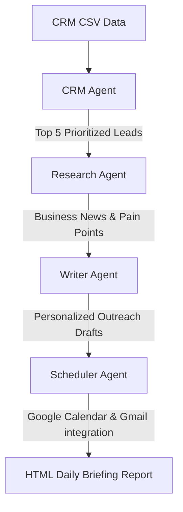

# DealPilot Multi-Agent Pipeline Diagram

Below is the Mermaid sequence diagram representing the sequential flow of the DealPilot multi-agent sales orchestration pipeline.

### Flow Explanation

1. **CRM CSV Data**: The pipeline starts by fetching raw prospect details from a CSV file.
2. **CRM Agent**: Computes the win probability scores and filters the top 5 highest-priority deals.
3. **Research Agent**: Scrapes or retrieves recent news, challenges (pain points), and suggested talking points for these top companies.
4. **Writer Agent**: Mimics the selected SDR's tone and format using few-shot learning to write a personalized sales email.
5. **Scheduler Agent**: Schedules follow-ups on Google Calendar and triggers the delivery of the final HTML Daily Briefing.
